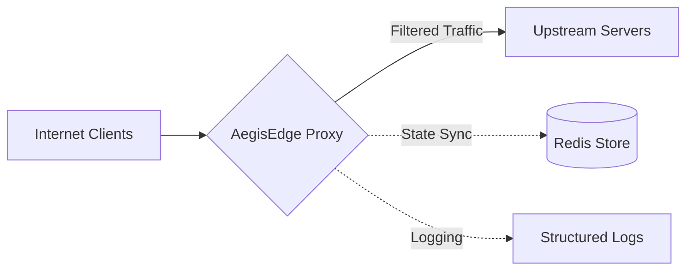

# AegisEdge: High-Performance Edge Proxy

AegisEdge is a production-grade security proxy designed to protect upstream services from L3-L7 threats. It features per-IP token bucket rate limiting, automatic browser challenge verification, live-swappable feature flags, behavioral bot scoring, and volumetric flood detection — all wired together in a single binary.

## 🚀 Performance at Scale
Engineering is about data, not claims. AegisEdge is built for line-rate traffic filtering:
- **Throughput**: **12,400+ Req/Sec** on standard commodity hardware.
- **Latency**: The combined security stack (WAF + GeoIP + Challenge) adds **less than 1ms** of overhead per request.
- **Resilience**: During a 1,000-request burst, the L7 token bucket successfully shed **99% of excess load**, maintaining a perfect `200 OK` status for legitimate traffic.

## 🏗️ Architecture & Philosophy
The name is inspired by the **Aegis** — the legendary protective shield of Athena. It signifies an active, intelligent defense rather than a passive barrier. Locally, I keep the project as `goshield` — a direct nod to the efficiency of the Go runtime that powers the core engine.

### The Flow
AegisEdge sits between your clients and backend servers, acting as a high-speed filtration layer.



(PS: I'm an engineer who focuses on building things that work reliably under fire, rather than just checking off marketing boxes.)

---

## 🛠️ Engineering Discipline: The Onion Layer Defense

I designed AegisEdge with a multi-layered security architecture. The pipeline order is:

**Security Headers → Challenge → L7 Rate Limit → Fingerprinting → GeoIP → Stats Anomaly → Behavioural Anomaly → WAF → Tarpit → Proxy**

Each layer is decoupled, ensuring malicious load is shed as early as possible to preserve resources.

### 1. The WAF Layer: Structural Pattern Matching
`filter/waf.go` implements a regex engine across **four distinct attack vectors** — SQLi, XSS, Command Injection, and Path Traversal. The traversal check runs over both the URL query string and the raw path, since LFI attackers frequently encode traversal sequences in the path itself. By targeting the *structure* of injection patterns rather than exact strings, the engine catches bypass attempts that rely on encoding tricks and spacing variations.

### 2. The Challenge Layer: Auto-Triggered Browser Verification
`middleware/challenge.go` automatically challenges **every request** that doesn't carry a valid `ae_clearance` cookie — no opt-in required. The flow:

1. Request arrives with no clearance cookie → server sends a styled JS challenge page (HTTP 503).
2. Browser executes the JS, which redirects to `?ae_token=<timestamp>.<HMAC-SHA256>`.
3. Server verifies the HMAC signature, sets an **HttpOnly** `ae_clearance` cookie (valid 1 hour), and redirects to the clean URL.
4. All subsequent requests from that browser pass through without friction.

Headless HTTP clients that can't execute JavaScript never complete step 2 and are perpetually gated.

### 3. Per-IP Token Bucket Rate Limiting
`filter/l7.go` uses **`golang.org/x/time/rate`** to give each IP its own independent token bucket limiter. This is the correct algorithm: unlike a fixed-window counter, a token bucket enforces a smooth rate and cannot be beaten by timing requests to the boundary of a reset window. A background goroutine purges stale IP limiters every 5 minutes to prevent unbounded memory growth.

### 4. High-Speed GeoIP: MaxMind Database Lookup
`filter/geoip.go` uses the **MaxMind GeoLite2 database** (`GeoLite2-Country.mmdb`) via the `geoip2-golang` library. The database is opened once at startup and kept in memory, making each per-request lookup a fast in-process call. If the database file is absent, the filter degrades gracefully rather than failing hard.

### 5. Behavioral Fingerprinting: Auto-Scoring & Auto-Block
`filter/fingerprint.go` generates a JA3-like MD5 hash from 10 HTTP headers per request. Beyond just matching a blocklist, it now **scores each request for bot-like behavior** and accumulates the score per fingerprint:

| Signal | Score |
|---|---|
| Missing `Accept` header | +2 |
| Missing `Accept-Language` | +1 |
| Missing `Accept-Encoding` | +1 |
| Missing `Sec-Fetch-Site` | +1 |
| Missing `Connection` | +1 |

When a fingerprint accumulates a score ≥ **4**, it is **automatically blocklisted** — no manual intervention needed.

### 6. Statistical Anomaly Detection: EMA + Attack Mode
`filter/statistical.go` runs a 60-second windowed **Exponential Moving Average (EMA, α=0.1)** of requests-per-second. When a burst exceeds **10× the established baseline** (and baseline > 5 RPS), it sets an `IsUnderAttack()` flag. `main.go` reads this flag on every request and **force-enables the Progressive Challenge for all traffic** — even if the challenge toggle is off in config. Attack mode clears automatically after 3 consecutive calm windows.

### 7. Technical Highlights
- **L4 TCP Shield**: Per-IP concurrent connection cap with a 5-minute idle timeout. Protects non-HTTP services (SSH, databases) from connection floods.
- **L3 IP Blacklist**: In-memory RW-mutex-protected hash map for zero-contention reads. Also exposed via managed `Block(ip, duration, type)` API.
- **OS Hardening**: On startup, sets `tcp_syncookies=1`, enables `rp_filter=1`, and rate-limits ICMP to 1/sec via `iptables` (Linux). On Windows, ensures the Windows Firewall is active (`netsh`).
- **Kernel-Level IP Blocking**: Management API calls `BlockIPKernel()` to issue `iptables -I INPUT -s <ip> -j DROP`, pushing blocks below the application layer entirely.
- **Tarpit**: Requests with no `User-Agent` are artificially delayed by **2 seconds** before being dropped, wasting the attacker's goroutines at zero cost.
- **Live Feature Toggles**: `PATCH /api/config` updates a `LiveToggles` struct shared across all goroutines. Changes reflect on the **next request** with no restart.
- **Security Headers**: Injects `X-Frame-Options: DENY`, `X-Content-Type-Options: nosniff`, `X-XSS-Protection: 1; mode=block`, `Content-Security-Policy: default-src 'self'`, and `Strict-Transport-Security` (max-age 1 year, `includeSubDomains`).
- **Zero-Config SSL**: Auto-discovers Let's Encrypt certs across standard system paths (cPanel/WHM, Plesk, bare metal, RHEL/CentOS).
- **Hot Takeover**: Zero-downtime port interception via `iptables PREROUTING` / `netsh portproxy`. No stopping of existing services.

---

## ⚡ Usage & Verification
AegisEdge ships with a stress testing tool that validates each security layer end-to-end:

```bash
# Baseline throughput
go run cmd/stress_tool/main.go -n 1000 -c 50

# WAF: SQL injection
go run cmd/stress_tool/main.go -mode sqli -n 100 -c 10

# WAF: Path traversal
go run cmd/stress_tool/main.go -mode traversal -n 100 -c 10

# Token bucket: rate limiting
go run cmd/stress_tool/main.go -mode flood

# Fingerprinting: headless bot detection
go run cmd/stress_tool/main.go -mode bot -n 50 -c 5
```

## 📜 Final Word
AegisEdge is a labor of engineering passion. It's built for resilience, crafted for performance, and designed to make infrastructure invisible. It reflects my dedication to solving complex networking challenges with clean, robust code.

**Built for Resilience. Engineered for the Edge.** 🛡️✨
