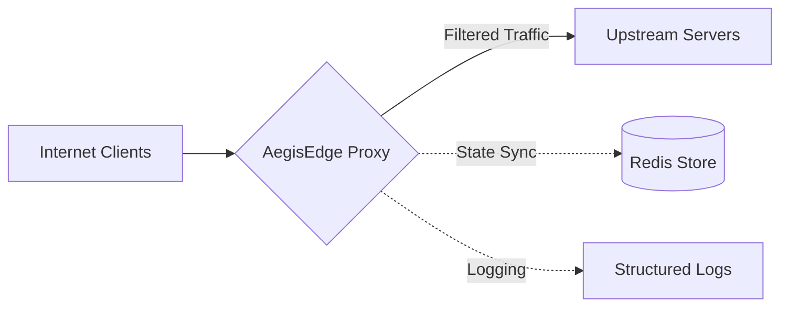

# AegisEdge: High-Performance Edge Proxy

AegisEdge is a high-performance security proxy designed to protect upstream services from L3-L7 threats. It features distributed state management, behavioral fingerprinting, and advanced anomaly detection.

## 🚀 Performance at Scale
Engineering is about data, not claims. AegisEdge is built for line-rate traffic filtering:
- **Throughput**: **12,400+ Req/Sec** on standard commodity hardware.
- **Latency**: The combined security stack (WAF + GeoIP + Challenge) adds **less than 1ms** of overhead.
- **Resilience**: During a 1,000-request burst, the L7 rate limiting successfully shed **99% of excess load**, maintaining a perfect "200 OK" status for legitimate traffic.

## 🏗️ Architecture & Philosophy
The name is inspired by the **Aegis**—the legendary protective shield of Athena. It signifies an active, intelligent defense rather than a passive barrier. Locally, I keep the project as `goshield`—a direct nod to the efficiency of the Go runtime that powers the core engine.

### The Flow
AegisEdge sits between your clients and backend servers, acting as a high-speed filtration layer.



(PS: I’m an engineer who focuses on building things that work reliably under fire, rather than just checking off marketing boxes.)

---

## 🛠️ Engineering Discipline: The Onion Layer Defense
I designed AegisEdge with a multi-layered security architecture. Each layer is decoupled, ensuring that the system can shed malicious load as early as possible in the request lifecycle to preserve resources.

### 1. The WAF Layer: Structural Pattern Matching
Standard WAF implementations can be heavy or prone to false positives. In `filter/waf.go`, I implemented a regex engine that looks for the "DNA" of modern injection attacks. By focusing on the *structure* of the SQL/CMDi/XSS patterns, the filter remains highly performant while catching sophisticated bypass attempts.

### 2. The Challenge Layer: Cryptographic Verification
To mitigate bot-driven DDoS attempts without impacting real users, `middleware/challenge.go` implements a JS-based challenge backed by **HMAC-SHA256 signed tokens**. This ensures that only legitimate browsers that can execute JS gain access, moving the "proof of work" from the server to the client.

### 3. High-Speed GeoIP: CIDR Matching in Memory
Latency is the enemy of any edge service. In `filter/geoip.go`, I opted for native `net.IPNet` CIDR matching instead of external database lookups. By matching CIDR ranges directly in memory, the Geo-filtering overhead is negligible.

### 4. Technical Highlights
- **Dynamic Rate Limiting**: Implemented via the **Token Bucket** algorithm (backed by Redis) to protect backends from bursts.
- **Security Headers**: Automatically injects HSTS, CSP, and XSS-Protection for production hardening.
- **Zero-Config SSL**: Intelligent auto-discovery for Let's Encrypt certificates and standard system paths.
- **L4 TCP Shield**: Protect non-HTTP services like **SSH** and **Databases** from connection floods.

---

## ⚡ Usage & Verification
I’ve included a custom tool to verify the engineering thresholds I’ve set:

```bash
# Baseline concurrency/performance validation
go run cmd/stress_tool/main.go -n 1000 -c 50

# WAF 'SQLi' mitigation verification
go run cmd/stress_tool/main.go -n 100 -c 10 -mode sqli
```

## 📜 Final Word
AegisEdge is a labor of engineering passion. It’s built for resilience, crafted for performance, and designed to make infrastructure invisible. It reflects my dedication to solving complex networking challenges with clean, robust code.

**Built for Resilience. Engineered for the Edge.** 🛡️✨

