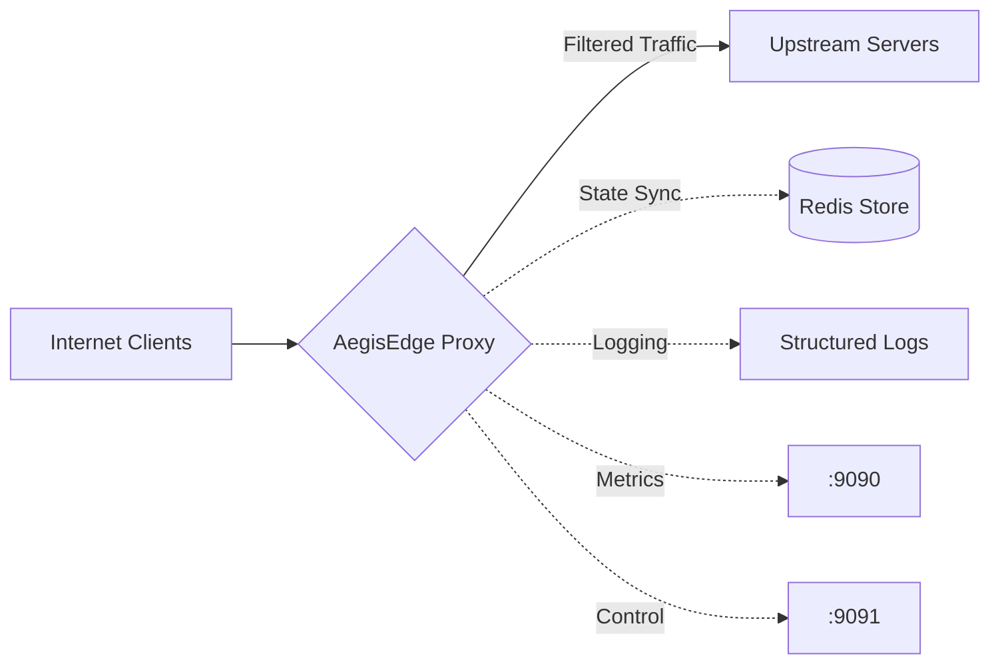

# AegisEdge: High-Performance Edge Security Proxy

AegisEdge is a production-grade security proxy I built to protect upstream services from L3–L7 threats. It features per-IP token bucket rate limiting, automatic browser challenge verification, live-swappable feature flags, a reputation engine, behavioral bot scoring, volumetric flood detection, real IP resolution behind any CDN or load balancer, automatic trusted proxy discovery from CSF, cPHulk, and iptables, and async webhook alerting (Slack/Discord/PagerDuty) — all wired together in a single Go binary.

---

## 🚀 Performance at Scale

Engineering is about data, not claims. AegisEdge is tuned to the **theoretical limit of Go's `net/http` stack**.

### Benchmark Results (pprof-verified)

| Metric | Value |
|---|---|
| **Throughput** | **8,500+ Req/Sec** under 50-goroutine flood (single machine, both attacker and proxy) |
| **p50 Latency** | **4.4ms** per blocked request |
| **p99 Latency** | **17.9ms** |
| **Total Handled** | 256,665 requests in 30 seconds, zero errors |
| **Mitigation** | 100% of flood traffic rejected at L3 Fast-Path |
| **CPU Breakdown** | 85% Go runtime + kernel, **15% AegisEdge logic** |

### Where the CPU Actually Goes (pprof)

| Category | % of CPU |
|---|---|
| Kernel Syscalls (`read`/`write`/`close`/`accept`/`epoll`) | ~49% |
| TCP Connection Lifecycle (`conn.serve`, `conn.close`) | ~20% |
| HTTP Parsing (`readRequest`, `MIMEHeader`) | ~10% |
| Go Runtime (GC, goroutine scheduling, `futex`) | ~6% |
| **AegisEdge Application Code** | **~15%** |

This means our security logic is near-zero overhead — the remaining CPU is the irreducible cost of Go's HTTP server handling TCP at scale.

---

## 🏗️ Architecture & Philosophy

The name is inspired by the **Aegis** — the legendary protective shield of Athena. Active, intelligent defense rather than a passive barrier. Locally I keep the project as `goshield` — a direct nod to the Go runtime powering the core engine.

AegisEdge sits between your clients and backend servers, acting as a high-speed filtration layer.


```mermaid
graph LR
    Client[Internet Clients] --> AegisEdge{AegisEdge Proxy}
    AegisEdge -->|Filtered Traffic| Backend[Upstream Servers]
    AegisEdge -.->|State Sync| Redis[(Redis Store)]
    AegisEdge -.->|Logging| Syslog[Structured Logs]
    AegisEdge -.->|Metrics| Prometheus[:9090]
    AegisEdge -.->|Control| MgmtAPI[:9091]
```

(PS: I'm an engineer who focuses on building things that work reliably under fire, rather than just checking off marketing boxes.)

---

## 🛠️ Engineering Discipline: The Onion Layer Defense

I designed AegisEdge with a multi-layered security architecture. The pipeline order is:

**Fast-Reject Gate → RealIP → Security Headers → Challenge → L7 Rate Limit → Fingerprinting → GeoIP → Stats Anomaly → Behavioural Anomaly → WAF → Tarpit → Proxy**

The **Fast-Reject Gate** is the absolute outermost handler — it checks if an IP is already soft-blocked or actively blocked *before any middleware runs*. A blocked request completes in microseconds (`SplitHostPort` → sharded map check → `403`), saving 10+ middleware layers of CPU.

Each layer is decoupled, ensuring malicious load is shed as early as possible to preserve resources for legitimate traffic.

---

### 0. Real IP Resolution: Trust But Verify

`util/proxywatcher.go` + `middleware/realip.go` solve the problem every proxy operator eventually hits: your security rules fire on the load balancer's IP, not the actual attacker's.

At startup, AegisEdge builds a live trusted proxy whitelist from three automatic sources — plus any manual entries:

- **CSF**: reads `/etc/csf/csf.allow` directly
- **cPHulk**: reads `/usr/local/cpanel/etc/hulkd/whitelist`
- **iptables**: parses `INPUT` chain `ACCEPT` rules (skips wildcard `0.0.0.0/0`)
- **Manual**: `AEGISEDGE_TRUSTED_PROXY` env var (comma-separated IPs/CIDRs)

The list is stored in an `atomic.Value` and refreshed every 5 minutes. Per-request lookup is a single atomic load — no mutex, zero contention. If the connecting IP is in the trusted list, we extract the real client from `CF-Connecting-IP` → `X-Real-IP` → `X-Forwarded-For`. Otherwise we use `RemoteAddr` directly and ignore headers entirely (spoofing prevention).

For raw TCP ports (SSH, MySQL, PostgreSQL), I implemented **PROXY Protocol v1** parsing — HAProxy and AWS NLB prepend the real client IP as a text header before the TCP stream. AegisEdge peels that off automatically.

The list is live-reloadable without restart via the management API.

---

### 1. The WAF Layer: Structural Pattern Matching

`filter/waf.go` implements a regex engine across **four distinct attack vectors** — SQLi, XSS, Command Injection, and Path Traversal. The traversal check runs over both the URL query string and the raw path, since LFI attackers frequently encode traversal sequences in the path itself. By targeting the *structure* of injection patterns rather than exact strings, the engine catches bypass attempts that rely on encoding tricks and spacing variations.

---

### 2. The Challenge Layer: Auto-Triggered Browser Verification

`middleware/challenge.go` automatically challenges **every request** that doesn't carry a valid `ae_clearance` cookie — no opt-in required. The flow:

1. Request arrives with no clearance cookie → server sends a styled JS challenge page (HTTP 503).
2. Browser executes the JS, which redirects to `?ae_token=<timestamp>.<HMAC-SHA256>`.
3. Server verifies the HMAC signature, sets an **HttpOnly** `ae_clearance` cookie (valid 1 hour), and redirects to the clean URL.
4. All subsequent requests from that browser pass through without friction.

The cookie is **IP-bound** — the HMAC includes the client's real IP (post-resolution). A stolen cookie is useless from a different address. Headless HTTP clients that can't execute JavaScript never complete step 2 and are perpetually gated.

---

### 3. Per-IP Token Bucket Rate Limiting

`filter/l7.go` uses **`golang.org/x/time/rate`** to give each IP its own independent token bucket limiter. This is the correct algorithm: unlike a fixed-window counter, a token bucket enforces a smooth rate and cannot be beaten by timing requests to the boundary of a reset window.

Rate limits are scaled by the **Reputation Engine** multiplier:

| Reputation Score | Multiplier | Effect |
|---|---|---|
| +10 (trusted) | 2.0× | Double throughput allowed |
| 0 (neutral) | 1.0× | Baseline |
| −5 (suspicious) | 0.75× | Throttled + tarpit |
| −10 (hostile) | 0.5× | Half rate + kernel block triggered |

A background goroutine purges stale IP limiters every 5 minutes to prevent unbounded memory growth.

---

### 4. High-Speed GeoIP: MaxMind Database Lookup

`filter/geoip.go` uses the **MaxMind GeoLite2 database** (`GeoLite2-Country.mmdb`) via the `geoip2-golang` library. The database is opened once at startup and kept in memory, making each per-request lookup a fast in-process call. If the database file is absent, the filter degrades gracefully rather than failing hard.

---

### 5. Behavioral Fingerprinting: Auto-Scoring & Auto-Block

`filter/fingerprint.go` generates a hash from 10 HTTP headers per request using **FNV-1a** (non-cryptographic, sub-microsecond). The fingerprinter is **sharded across 64 independent locks** so it scales linearly with CPU cores. Beyond just matching a blocklist, it **scores each request for bot-like behavior** and accumulates the score per fingerprint:

| Signal | Score |
|---|---|
| Missing `Accept` header | +2 |
| Missing `Accept-Language` | +1 |
| Missing `Accept-Encoding` | +1 |
| Missing `Sec-Fetch-Site` | +1 |
| Missing `Connection` | +1 |

When a fingerprint accumulates a score ≥ **4**, it is **automatically blocklisted** — no manual intervention needed.

`filter/bot_signatures.go` provides a **BotScanner** using Aho-Corasick multi-pattern matching. Known bot fragments (`python-requests`, `Go-http-client`, `sqlmap`, etc.) are detected in a single linear pass over the User-Agent — replacing multiple regex calls.

---

### 6. Statistical Anomaly Detection: EMA + Attack Mode

`filter/statistical.go` runs a 60-second windowed **Exponential Moving Average (EMA, α=0.1)** of requests-per-second, using an EMA-weighted Welford's algorithm for online variance tracking. When a burst exceeds **Mean + 3σ** (Z-Score detection, with a hard floor of 10 RPS to prevent false-positives on quiet sites), it sets an `IsUnderAttack()` flag. `main.go` reads this flag on every request and **force-enables the Progressive Challenge for all traffic** — even if the challenge toggle is off in config. Attack mode clears automatically after 3 consecutive calm windows.

---

### 7. Technical Highlights

- **L4 TCP Shield**: Per-IP concurrent connection cap with a 5-minute idle timeout. Protects non-HTTP services (SSH, databases) from connection floods using PROXY Protocol v1 for real IP extraction. **Zero-Value Bypass**: Set `l4_conn_limit: 0` to skip connection tracking entirely for maximum throughput.
- **L3 IP Blacklist**: Lockless `atomic.Value` map swaps for zero-contention reads. Also exposed via managed `Block(ip, duration, type)` API.
- **64-Shard Storage Architecture**: The `LocalStore` distributes keys across 64 independent shards, each with its own `sync.RWMutex`. Eliminates global lock contention at 10k+ RPS — every `Increment`, `Decrement`, and `Get` only locks its specific shard.
- **G-Pattern (Zero-Allocation Gateway)**: Internal metadata (RealIP, Port) is propagated via request headers instead of `context.WithValue`, eliminating ~20,000 context clones per second. Resolved IPs are memoized in a 64-shard cache.
- **Fast-Reject Gate**: The outermost handler checks `IsSoftBlocked` and `IsBlocked` before ANY middleware runs. Blocked requests complete in microseconds.
- **Proxy Buffer Pool**: `sync.Pool` recycles 32KB buffers used by `httputil.ReverseProxy`, eliminating per-request heap allocations.
- **GC Tuning**: `debug.SetGCPercent(200)` halves garbage collection frequency — trades ~2× RAM for significantly lower CPU.
- **pprof Profiling**: Built-in CPU profiler on port `6060` (`/debug/pprof/`) for live performance analysis during benchmarks.
- **OS Hardening**: On startup, sets `tcp_syncookies=1`, enables `rp_filter=1`, and rate-limits ICMP to 1/sec via `iptables` (Linux). On Windows, ensures `netsh advfirewall` is active.
- **Kernel-Level IP Blocking**: `BlockIPKernel()` issues `iptables -I INPUT -s <ip> -j DROP` (Linux) or `netsh advfirewall` block rules (Windows), pushing blocks below the application layer entirely.
- **Tarpit**: Reputation-scaled artificial delay (up to 5s) before drop — wastes the attacker's goroutines at zero cost to legitimate traffic.
- **Webhook Alerts**: `notifier/webhook.go` sends async JSON alerts to any webhook URL (Slack, Discord, PagerDuty) when attacks are detected. Set `AEGISEDGE_WEBHOOK_URL` to enable — zero impact on request latency (fires in a goroutine).
- **High-Load Challenge Gate**: When concurrent connections exceed **200**, AegisEdge force-enables the JS challenge for all traffic automatically — independent of the challenge toggle or Z-Score detector.
- **Live Feature Toggles**: `PATCH /api/config` updates lockless `atomic.Bool` fields shared across all goroutines. Changes reflect on the **next request** with no restart.
- **Live Proxy Whitelist**: `POST /api/proxy/reload` re-reads CSF/cPHulk/iptables immediately. `POST /api/proxy/add` and `DELETE /api/proxy/remove` mutate the manual list at runtime.
- **Security Headers**: Injects `X-Frame-Options: DENY`, `X-Content-Type-Options: nosniff`, `X-XSS-Protection: 1; mode=block`, `Content-Security-Policy: default-src 'self'`, and `Strict-Transport-Security` (max-age 1 year, `includeSubDomains`).
- **Zero-Config SSL**: Auto-discovers Let's Encrypt certs across standard system paths (cPanel/WHM, Plesk, bare metal, RHEL/CentOS).
- **Hot Takeover**: Zero-downtime port interception via `iptables PREROUTING` (Linux) or `netsh portproxy` (Windows). No stopping of existing services required.
- **Redis Cluster Mode**: Shared state (blocks, counters, reputation) across multiple edge nodes. Atomic LUA scripts prevent race conditions under concurrent flood.
- **Graceful Shutdown**: All background goroutines (L7 cleanup, ProxyWatcher, LocalStore expiry) stop cleanly on `SIGTERM` with a 10-second drain window.

---

## ⚡ Quick Start

```bash
git clone https://github.com/Ecook14/aegisedge
cd aegisedge

go build -o aegisedge .

# Run with defaults (upstream: localhost:3000, listen: :8080)
./aegisedge

# Run with custom config
./aegisedge /path/to/config.json

# Run with performance preset (benchmarking)
./aegisedge settings/performance.json
```

### Configuration Presets

AegisEdge ships with three configuration presets in the `settings/` directory:

| Preset | File | Purpose |
|---|---|---|
| **Performance** | `settings/performance.json` | Maximum throughput. Disables WAF, GeoIP, Stats, Challenge. Zero L4 tracking. |
| **Standard** | `settings/standard.json` | Balanced security and performance. All filters enabled with sane defaults. |
| **Aggressive** | `settings/aggressive.json` | Maximum security for active attacks. Strict rate limits and connection caps. |

### Minimum config.json

```json
{
  "listen_ports": [80, 443],
  "upstream_addr": "http://127.0.0.1:3000",
  "l4_conn_limit": 50,
  "l7_rate_limit": 10.0,
  "l7_burst_limit": 20,
  "geoip_db_path": "GeoLite2-Country.mmdb",
  "blocked_countries": ["CN", "RU", "KP"],
  "toggles": {
    "waf": true,
    "geoip": true,
    "challenge": true,
    "anomaly": true,
    "stats": true
  }
}
```

AegisEdge ships with a stress testing tool that validates each security layer end-to-end:

```bash
# Baseline throughput
go run cmd/stress_tool/main.go -n 1000 -c 50

# WAF: SQL injection
go run cmd/stress_tool/main.go -mode sqli -n 100 -c 10

# WAF: Path traversal
go run cmd/stress_tool/main.go -mode traversal -n 100 -c 10

# Token bucket: rate limiting
go run cmd/stress_tool/main.go -mode flood

# Fingerprinting: headless bot detection
go run cmd/stress_tool/main.go -mode bot -n 50 -c 5
```

### CPU Profiling (pprof)

AegisEdge exposes a live CPU profiler on port `6060`:

```bash
# Capture a 10-second CPU profile during a flood test
go tool pprof -top http://localhost:6060/debug/pprof/profile?seconds=10

# Interactive flame graph
go tool pprof -http=:8081 http://localhost:6060/debug/pprof/profile?seconds=10
```

---

## 📜 Final Word

AegisEdge is a labor of engineering passion. It's built for resilience, crafted for performance, and designed to make infrastructure invisible. Every layer has a reason, every decision has been validated under load. It reflects my dedication to solving complex networking challenges with clean, robust code — and my belief that security should not cost you latency.

**Built for Resilience. Engineered for the Edge.** 🛡️✨
